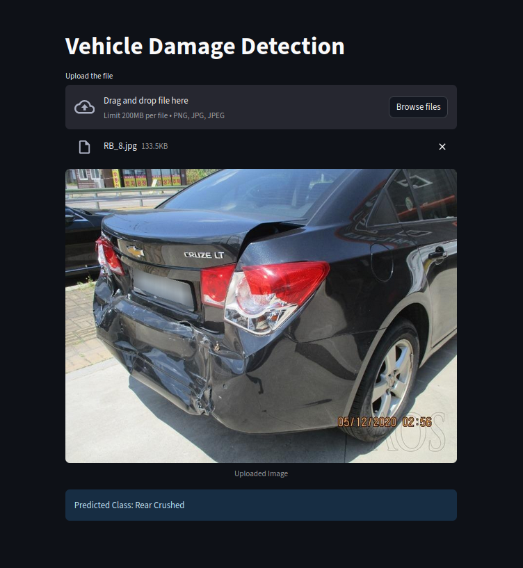

# Vehicle Damage Detection (Streamlit + PyTorch)

A simple web app that classifies vehicle damage from a single image using a fine‑tuned ResNet‑50 model.  
It predicts one of six classes:
- **Front Breakage**
- **Front Crushed**
- **Front Normal**
- **Rear Breakage**
- **Rear Crushed**
- **Rear Normal**
  
<p align="center">
  
</p>

---

## ✨ Features
- Drag‑and‑drop image upload (`.png`, `.jpg`).
- Immediate preview of the uploaded image.
- Single‑click prediction with a pre‑loaded PyTorch model.
- Lightweight Streamlit UI that you can deploy anywhere (local, Docker, or the cloud).

---

## 🗂️ Repository Structure
```
.
├── app.py # Streamlit UI
├── model_helper.py # Model definition + prediction helper
├── model/ # Put your model weights here (saved_model.pth)
├── front_crushed.png # Screenshot for README
├── requirements.txt # Dependencies
└── README.md
```

---

## 🚀 Quickstart

### 1) Create and activate an environment
```bash
# Python 3.10+ recommended
python -m venv .venv
source .venv/bin/activate   # Windows: .venv\Scripts\activate
```

### 2) Install dependencies
```bash
pip install -r requirements.txt
```

> If you are on a machine with CUDA, install the appropriate `torch` build from the official site instructions.

### 3) Put your model weights
Place your fine‑tuned weights file at `model/saved_model.pth`. Create the `model/` folder if it does not exist.

### 4) Run the app
```bash
streamlit run app.py
```
Then open the printed local URL in your browser (usually `http://localhost:8501`).

---

## 🧠 Model Overview

- **Backbone:** ResNet‑50 (ImageNet weights).
- **Fine‑tuning strategy:** Early layers frozen; last residual block (`layer4`) and classification head are trainable.
- **Input size:** 224×224 RGB.
- **Preprocessing:** Resize → ToTensor → Normalize with ImageNet means/stds.
- **Output:** 6 logits (one per class), converted to the top‑1 predicted label.

### Inference pipeline (high‑level)
1. Open the uploaded file with Pillow and convert to RGB.
2. Apply the TorchVision transforms (resize, tensor, normalize).
3. Run a forward pass through the model in `eval()` with `no_grad()`.
4. Take `argmax` over the logits and map to a human‑readable class name.

---

## 🧩 How the App Works (Core Files)

### `app.py` (Streamlit UI)
- Renders the page title and a file uploader (PNG/JPG).
- Saves the uploaded file as `temp_file.jpg`.
- Displays the image and calls `predict()` to get the class label.
- Shows the predicted class in an info box.

### `model_helper.py` (Model + Predict)
- Defines a `CarClassifierResNet` module based on ResNet‑50.
- Loads `model/saved_model.pth` once and caches the model in memory.
- Exposes `predict(image_path: str) -> str`, which returns the string label.

---

## 📦 Dataset & Training (notes to future readers)
This repository focuses on **inference**. To reproduce training:
- Prepare a labeled dataset with the six classes listed above.
- Start from ResNet‑50 with pretrained ImageNet weights.
- Freeze earlier layers; unfreeze `layer4` and the classifier head.
- Use standard augmentations (random crop/flip, color jitter, etc.).
- Train with Cross‑Entropy Loss; evaluate by accuracy, F1, and confusion matrices.
- Save the final weights to `model/saved_model.pth`.

---

## 🛠️ Troubleshooting

- **ModuleNotFoundError (Pillow/PIL):** Install `pillow` (PIL was the old package name):  
  `pip install pillow`
- **Torch CUDA errors:** Ensure the correct PyTorch build for your CUDA version.
- **Shape mismatches when loading weights:** Make sure your saved weights match the model head (same number of classes).

---


## 🙌 Acknowledgements
- Codebasics
- PyTorch & TorchVision teams
- Streamlit team
- ImageNet pretraining
