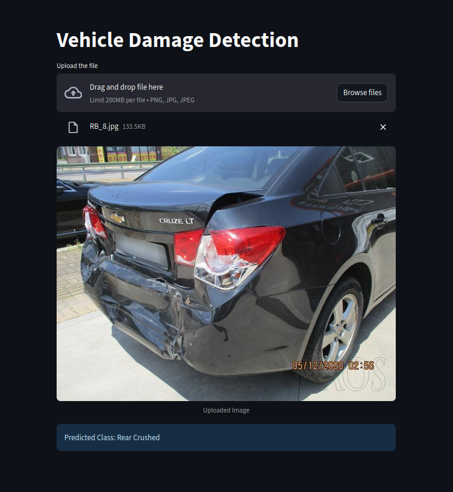

# Vehicle Damage Detection (Streamlit + PyTorch)

> **Live Demo:** [Click here to test the application](https://dl-project-car-damage-detection-gt7hh26vbdadrldftpd7p7.streamlit.app/)
A simple web app that classifies vehicle damage from a single image using a fine‑tuned ResNet‑50 model.  
It predicts one of six classes:
- **Front Breakage**
- **Front Crushed**
- **Front Normal**
- **Rear Breakage**
- **Rear Crushed**
- **Rear Normal**
  
<p align="center">
  
</p>

---

## ✨ Features
- Drag‑and‑drop image upload (`.png`, `.jpg`).
- Immediate preview of the uploaded image.
- Single‑click prediction with a pre‑loaded PyTorch model.
- Lightweight Streamlit UI that you can deploy anywhere (local, Docker, or the cloud).

---

## 🗂️ Repository Structure
```
.
├── app.py # Streamlit UI
├── model_helper.py # Model definition + prediction helper
├── model/ # Put your model weights here (saved_model.pth)
├── front_crushed.png # Screenshot for README
├── requirements.txt # Dependencies
├── training/
│   ├── train.py # Training script (stratified split, real held-out test set)
│   ├── eval_results.json # Test-set metrics for the current model/saved_model.pth
│   └── confusion_matrix.png
└── README.md
```

---

## 🚀 Quickstart

### 1) Create and activate an environment
```bash
# Python 3.10+ recommended
python -m venv .venv
source .venv/bin/activate   # Windows: .venv\Scripts\activate
```

### 2) Install dependencies
```bash
pip install -r requirements.txt
```

> If you are on a machine with CUDA, install the appropriate `torch` build from the official site instructions.

### 3) Put your model weights
Place your fine‑tuned weights file at `model/saved_model.pth`. Create the `model/` folder if it does not exist.

### 4) Run the app
```bash
streamlit run app.py
```
Then open the printed local URL in your browser (usually `http://localhost:8501`).

---

## 🧠 Model Overview

- **Backbone:** ResNet‑50 (ImageNet weights).
- **Fine‑tuning strategy:** Early layers frozen; last residual block (`layer4`) and classification head are trainable.
- **Input size:** 224×224 RGB.
- **Preprocessing:** Resize → ToTensor → Normalize with ImageNet means/stds.
- **Output:** 6 logits (one per class), converted to the top‑1 predicted label.

### Inference pipeline (high‑level)
1. Open the uploaded file with Pillow and convert to RGB.
2. Apply the TorchVision transforms (resize, tensor, normalize).
3. Run a forward pass through the model in `eval()` with `no_grad()`.
4. Take `argmax` over the logits and map to a human‑readable class name.

---

## 🧩 How the App Works (Core Files)

### `app.py` (Streamlit UI)
- Renders the page title and a file uploader (PNG/JPG).
- Saves the uploaded file as `temp_file.jpg`.
- Displays the image and calls `predict()` to get the class label.
- Shows the predicted class in an info box.

### `model_helper.py` (Model + Predict)
- Defines a `CarClassifierResNet` module based on ResNet‑50.
- Loads `model/saved_model.pth` once and caches the model in memory.
- Exposes `predict(image_path: str) -> str`, which returns the string label.

---

## 📦 Dataset & Training

- **Dataset:** 2,301 labeled images across the six classes (`F_Breakage` 500, `F_Crushed` 400, `F_Normal` 500, `R_Breakage` 300, `R_Crushed` 301, `R_Normal` 300).
- **Split:** stratified 70/15/15 train/val/test (`training/train.py`), seeded for reproducibility. The test set is held out and never used for training or model selection.
- **Augmentation (train only):** random horizontal flip, random rotation (±10°), color jitter.
- **Training:** ResNet‑50 backbone, `layer4` + classification head fine‑tuned, Adam (`lr=0.005`), 15 epochs, checkpoint selected by best validation macro‑F1.

### Test set results (n=345, held out)

| class | precision | recall | f1-score |
|---|---|---|---|
| Front Breakage | 0.775 | 0.920 | 0.841 |
| Front Crushed | 0.793 | 0.767 | 0.780 |
| Front Normal | 0.955 | 0.840 | 0.894 |
| Rear Breakage | 0.833 | 0.556 | 0.667 |
| Rear Crushed | 0.640 | 0.711 | 0.674 |
| Rear Normal | 0.769 | 0.889 | 0.825 |

**Accuracy: 79.7% · Macro-F1: 78.0%**

Rear Breakage/Rear Crushed are the main confusion pair — visually similar damage types with fewer training examples (300–301 images vs. 400–500 for front classes). See `training/confusion_matrix.png` for the full matrix.

To reproduce: `cd training && python train.py` (expects `../dataset/<class_name>/*.jpg`, ImageFolder layout).

---

## 🛠️ Troubleshooting

- **ModuleNotFoundError (Pillow/PIL):** Install `pillow` (PIL was the old package name):  
  `pip install pillow`
- **Torch CUDA errors:** Ensure the correct PyTorch build for your CUDA version.
- **Shape mismatches when loading weights:** Make sure your saved weights match the model head (same number of classes).

---


## 🙌 Acknowledgements
- Codebasics
- PyTorch & TorchVision teams
- Streamlit team
- ImageNet pretraining
